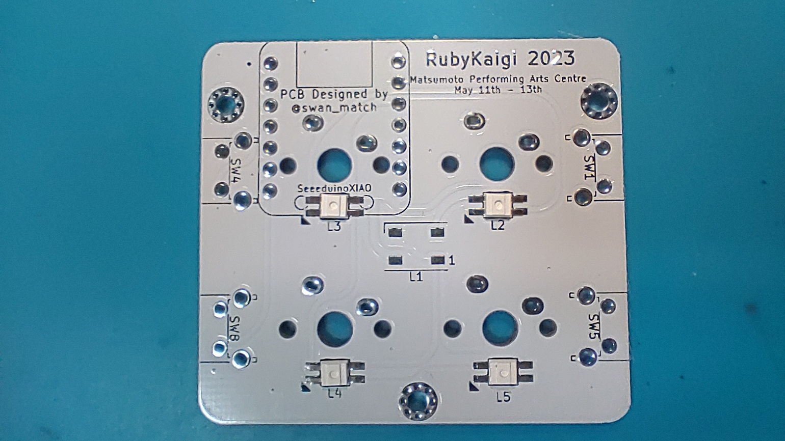
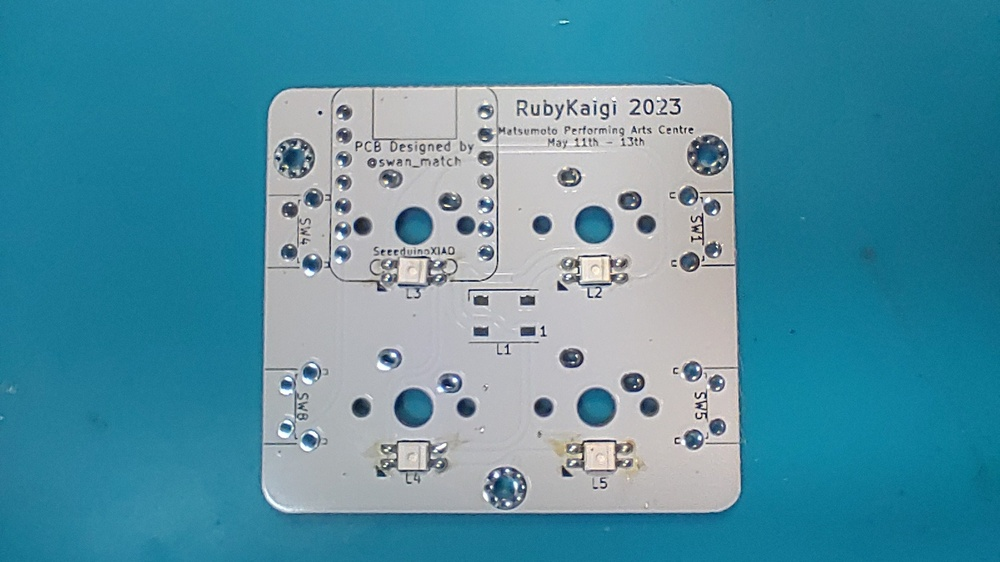
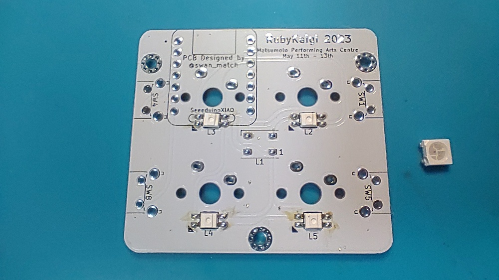
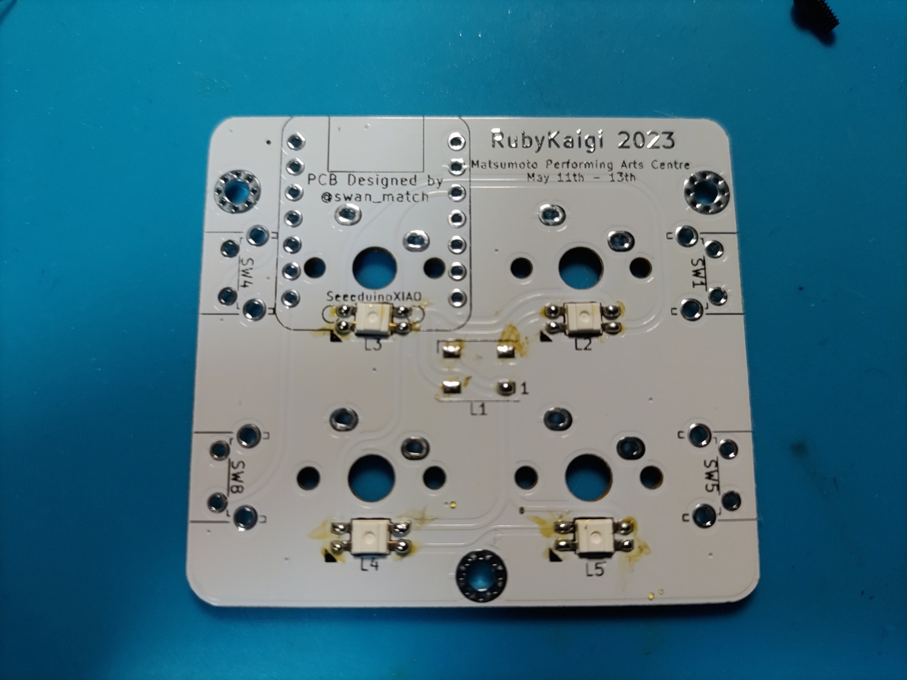
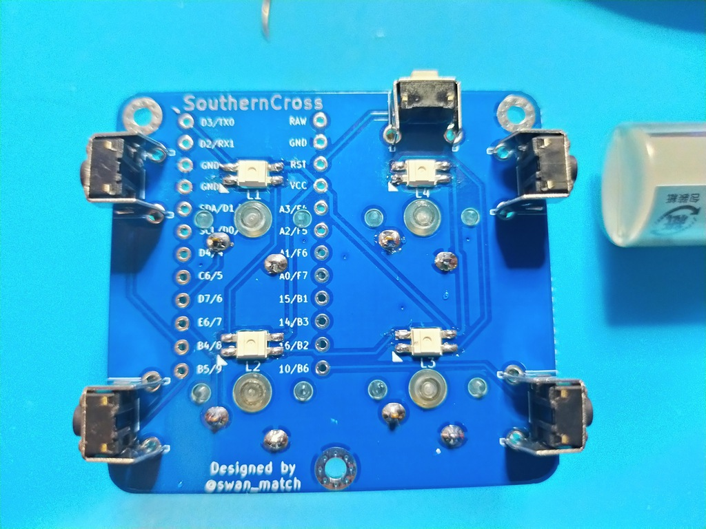
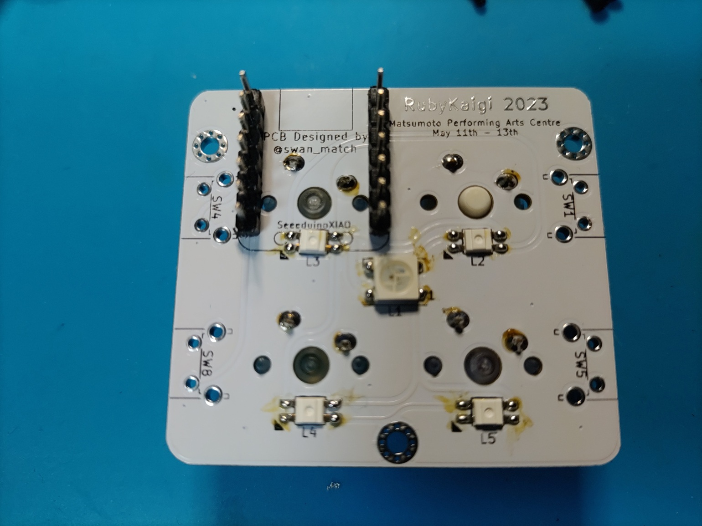
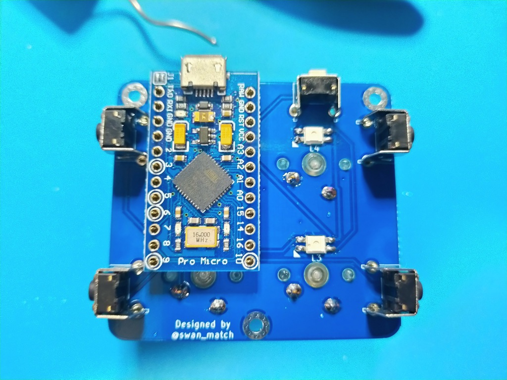
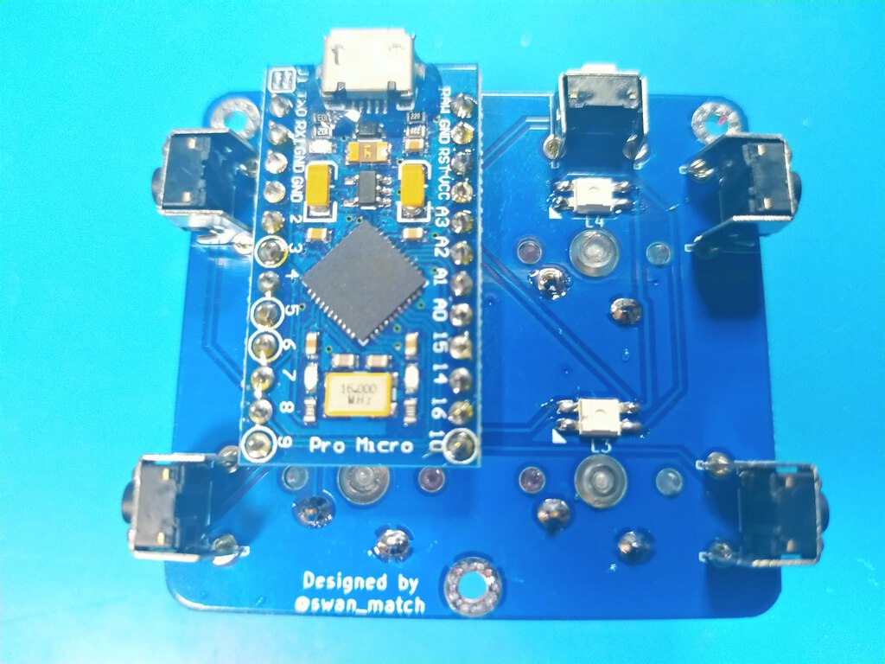
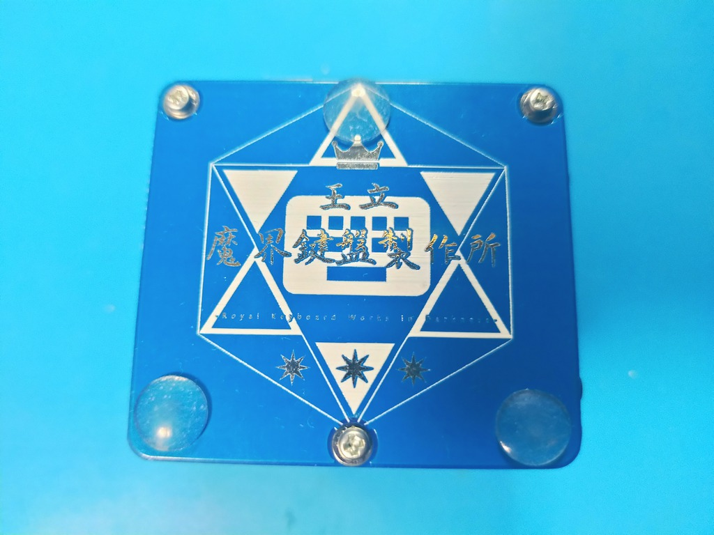
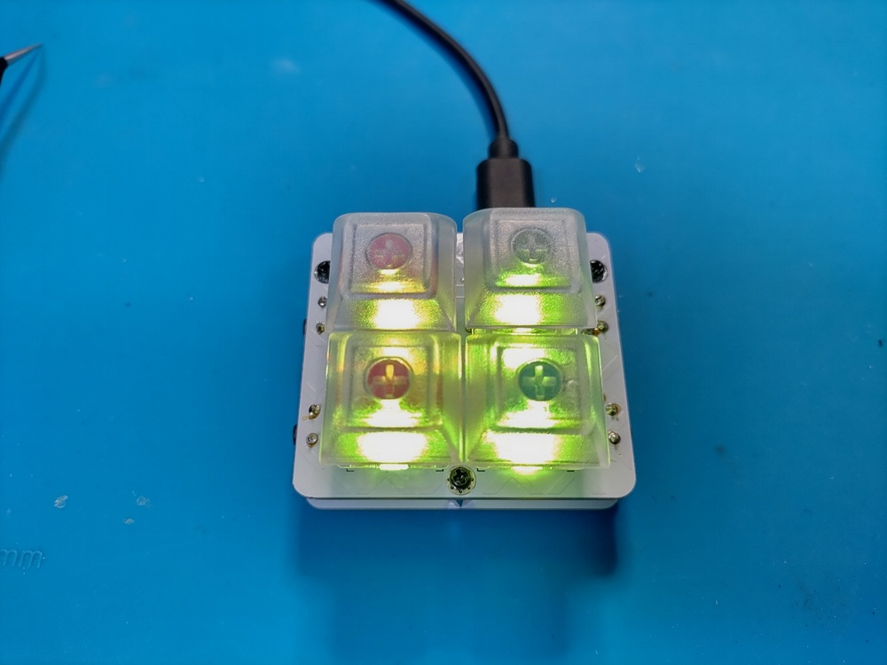

# SouthernCrossビルドガイド

## 部品

### 付属品

| 品目                    | 数量 |
| :---------------------- | ---: |
| PCB                     |  1枚 |
| ボトムプレート          |  1枚 |
| LED(SK6812mini)         |  4個 |
| M2L7丸スペーサ          |  3本 |
| M2L4ネジ                |  6本 |
| タクトスイッチ(大)      |  4個 |
| タクトスイッチ(小)      |  1個 |
| ゴム足                  |  3個 |

### 別途必要なもの

| 品目                     | 数量 | 入手先 |
| :----------------------- | ---: | :--- |
| ProMicro                 |  1個 | [遊舎工房(コンスルー付き)](https://shop.yushakobo.jp/products/promicro-spring-pinheader)<br>[talpkeyboard](https://talpkeyboard.net/items/5b24504ba6e6ee7ec60063e3) |
| コンスルー               |  2本 | [遊舎工房](https://shop.yushakobo.jp/collections/all-keyboard-parts/products/31)<br>[talpkeyboard](https://talpkeyboard.net/items/5e056626d790db16e2889233) |
| MX互換スイッチ(5pin推奨) |  4個 | [遊舎工房](https://shop.yushakobo.jp/collections/all-switches)<br>[talpkeyboard](https://talpkeyboard.net/?category_id=59cf8860ed05e668db003f5d) |
| 1Uキーキャップ           |  4個 | [遊舎工房](https://shop.yushakobo.jp/collections/keycaps/products/dsa-blank-keycaps)<br>[talpkeyboard](https://talpkeyboard.net/?category_id=59e2acfaed05e644fd004008) |
| USBケーブル              |  1本 | 100円ショップなど |


## 工具

| 品目               | 入手先 |
| :----------------- | :--- |
| 温度調整ハンダゴテ | [Amazon](https://www.amazon.co.jp/gp/product/B08L6KJBGP/ref=as_li_tl?ie=UTF8&camp=247&creative=1211&creativeASIN=B08L6KJBGP&linkCode=as2&tag=swanmatch06-22&linkId=902f31009670f3b7cd79891d00479e72)、ホームセンターなど |
| 低音はんだ         | 100円ショップなど |
| ニッパー           | 100円ショップなど |
| 2液混合接着剤      | 100円ショップなど |
| ピンセット         | 100円ショップなど |
| テスター           | [Amazon](https://www.amazon.co.jp/gp/product/B07GJ891VR/ref=as_li_tl?ie=UTF8&camp=247&creative=1211&creativeASIN=B07GJ891VR&linkCode=as2&tag=swanmatch06-22&linkId=bd42afeb7ff9ca4a61af44a62215c148)、ホームセンターなど |

ピンセット、テスターは必須ではないですが、買っておくことをおすすめします。

## 組み立て手順

### LED

LEDをはんだ付けします。  
三角のシルクマークが付いているパッドがLEDの欠けているタブに対応しています。  

LEDは比較的熱に弱いので、温度調整はんだごてで220℃くらいで、手早くはんだ付けしてください。





### スイッチ

基板をひっくり返してスイッチをはめ込み、
再度裏面からスイッチをはんだ付けします。
差し込む際にピンを曲げてしまわないように気をつけてください。





### タクトスイッチ

タクトスイッチを差し込み、
反対側(表、スイッチ側)に戻してはんだ付けします。

上部だけ小さいタクトスイッチを使います。

**裏表にはすごく気をつけてください。**  
試していないですが、多分キーを押し込んだときにキーキャップが干渉します。




### ProMicro

ここだけは間違えるとリカバリが面倒なので、**細心の注意**をして作業にあたってください  
コンスルーの取り付け方は[遊舎工房さんの記事](https://yushakobo.zendesk.com/hc/ja/articles/360044233974-%E3%82%B3%E3%83%B3%E3%82%B9%E3%83%AB%E3%83%BC-%E3%82%B9%E3%83%97%E3%83%AA%E3%83%B3%E3%82%B0%E3%83%94%E3%83%B3%E3%83%98%E3%83%83%E3%83%80-%E3%81%AE%E5%8F%96%E3%82%8A%E4%BB%98%E3%81%91%E6%96%B9%E3%82%92%E6%95%99%E3%81%88%E3%81%A6%E4%B8%8B%E3%81%95%E3%81%84)を参考にしてください。  
また、ProMicroはあらかじめいわゆる[「モゲ対策」](https://scrapbox.io/self-made-kbds-ja/%E3%82%82%E3%81%92%E4%BA%88%E9%98%B2)をしておくことをおすすめします。

まず、基板にコンスルーを差し込みます。



部品実装面が上になるようにPromicroを乗せます。  



はんだ付けします。




### ボトムプレート、ゴム足

ボトムプレートをスペーサーでネジ止めして、
ゴム足を貼り付けます。

ボトムプレートはリバーシブルです。




### ファームウェア

ファームウェアの書き込みには、ビルド済みのファームウェアを書き込んで、
Via/Remapというアプリケーションを使ってカスタマイズする方法と、  
ソースコードをコピーしてイチから作る方法があります。

前者のほうが簡単ですが、後者のほうが柔軟性が高いです。

#### VIA/Remapを使う場合。

ファームウェアを[こちら](https://github.com/swanmatch/SouthernCross/releases)からダウンロードして、  
[QMK toolbox](https://github.com/qmk/qmk_toolbox/releases)で書き込むことができます。

VIA対応のファームウェアを書き込んだ場合、GoogleChromeで[Remap](https://remap-keys.app/)にアクセスすることで、
ドラッグ&ドロップでキーマップを変更できます。


#### 自身でビルドして書き込む場合

Repmapでも大概のことは実現できますが、
公開しているファームウェアをもとに、
完全にオリジナルのキーマップを作成することも可能です。

といってもKeymapの定義くらいならそれほど難しくはないです。[こんな](https://github.com/swanmatch/qmk_firmware/blob/southerncross/keyboards/southern_cross/keymaps/default/keymap.c)かんじ。

ファームウェアの書き込みは以下のコマンドを実行します。  
QMKの環境構築についてはお使いのOSによって異なりなりますので、
[公式ドキュメント](https://docs.qmk.fm/#/)を読んでください。

```sh
git clone https://github.com/swanmatch/qmk_firmware.git
cd qmk_firmware
make git-submodule
git checkout southerncross
make southern_cross:default:avrdude
# via対応する場合
make southern_cross/via/:default:avrdude
# 33gakuキーマップを書き込むとき
make southern_cross:33gaku:avrdude
# via対応33gakuキーマップを書き込むとき
make southern_cross/via:33gaku:avrdude

# 自分のキーマップを作成する([your_name]部分は適宜変更)
cp keyboards/southern_cross/keymaps/default keyboards/southern_cross/keymaps/[your_name]
# 好きなエディタで `keyboards/southern_cross/keymaps/[your_name]/keymap.c`を編集する
make southern_cross:[your_name]:avrdude
```
-
`Detecting USB port, reset your controller now....`という表示になりましたら、
奥のサイドピン(RESETボタン)を押し込みます。

数秒で書き込みが完了します。


## 完成図


