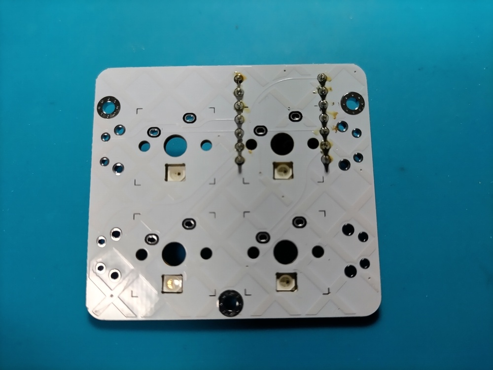
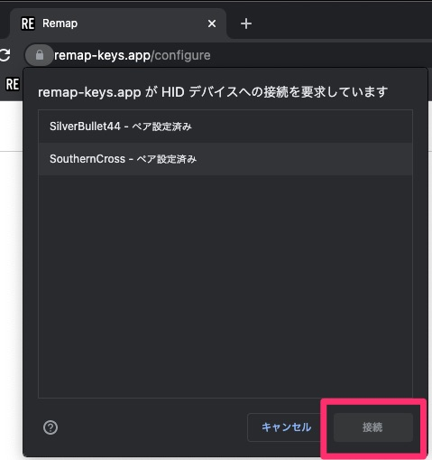
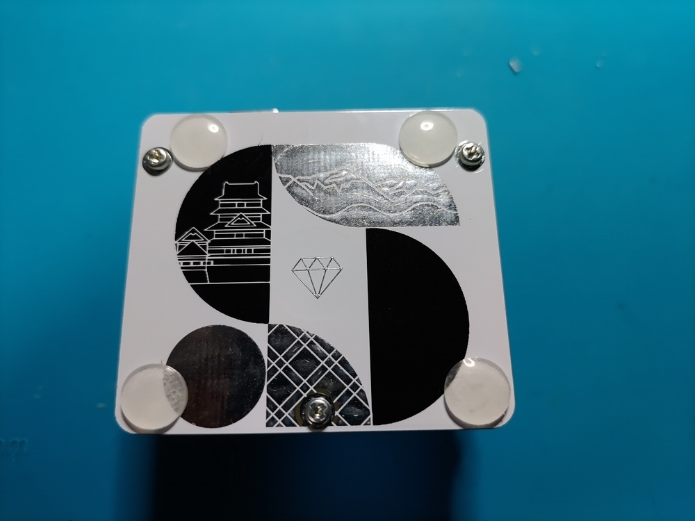

# RubyKaigi 2023 Novelty Keyboard Build Guide

## overview

Micropad distributed at RubyKaigi 2023.
 Although it is small, a total of 8 keys can be installed by installing an angled tact switch.
 It is very small and there are few soldering points, so it may be good for the first electronic work and firmware.
 It uses both underglow and backlight, so **it shines very well.**

## parts

### accessories

item | quantity
:-- | --:
PCBs | 1 sheet
bottom plate | 1 sheet
Small LED (SK6812mini) | Four
Large LED (WS2812B) | 1 piece
M2L7 round spacer | 3
M2L4 screw | 6
Tact switch (large) | Four
rubber foot | 4個

### Items required separately

item | quantity | where to get
:-- | --: | :--
XIAO RP2040 | 1 piece | [talp keyboard](https://talpkeyboard.net/items/63534f58f5197322fceb6487)  [Akizuki Electronics](https://akizukidenshi.com/catalog/g/gM-17044/)
7-pin pin header (*1) | Two | [Yusha Koubou](https://shop.yushakobo.jp/products/3696?_pos=2&_sid=62c590295&_ss=r&variant=42476836946151)  [Akizuki Electronics](https://akizukidenshi.com/catalog/g/gC-00167/)
MX compatible switch (5pin recommended) | Four | [Yusha Koubou](https://shop.yushakobo.jp/collections/all-switches)  [talp keyboard](https://talpkeyboard.net/?category_id=59cf8860ed05e668db003f5d)
1U keycap | Four | [Yusha Koubou](https://shop.yushakobo.jp/collections/keycaps/products/dsa-blank-keycaps)  [talp keyboard](https://talpkeyboard.net/?category_id=59e2acfaed05e644fd004008)
USB cable (TYPE-C) | One | 100 yen shop, etc.

*1 ) Note that the XIAO RP2040 may come with a pin header depending on the vendor.
 If it is a type that can be folded, you can purchase one with 14 pins or more and fold it into 7 pins each.
 If you have extra pin headers that come with the Promicro, you can use them too.

## tool

item | where to get
:-- | :--
temperature control soldering iron | [Amazon](https://www.amazon.co.jp/gp/product/B08L6KJBGP/ref=as_li_tl?ie=UTF8&camp=247&creative=1211&creativeASIN=B08L6KJBGP&linkCode=as2&tag=swanmatch06-22&linkId=902f31009670f3b7cd79891d00479e72) , home centers, etc.
low temperature solder | 100 yen shop, etc.
tweezers | 100 yen shop, etc.
Masking tape | 100 yen shop, etc.
Nippers | 100 yen shop, etc.
Tester (required in case of trouble) | [Amazon](https://www.amazon.co.jp/gp/product/B07GJ891VR/ref=as_li_tl?ie=UTF8&camp=247&creative=1211&creativeASIN=B07GJ891VR&linkCode=as2&tag=swanmatch06-22&linkId=bd42afeb7ff9ca4a61af44a62215c148) , home centers, etc.

## Assembly procedure

### firmware

Before starting the implementation, first check if the RP2040 microcontroller is functioning properly.

1. While pressing the Boot button (on the right) of XIAO RP2040, connect it to your PC with a USB cable and confirm that it is mounted as a file system with a volume called `RPI-RP2` .
2. Download the .u2f file from [PRK Firmware](https://github.com/picoruby/prk_firmware/releases) . (Latest stable version if not particular)
3. Drag and drop the u2f file to the mounted file system of RP2040.
4. It will be remounted as `PRK_FIRMWARE` , so download [keymap.rb](./keymap.rb) and drag &amp; drop it.

If this procedure does not work, there is a high possibility that the RP2040 is defective.
 Please give up on your bad luck and buy another one...

### SK6812MINI

Solder the LED (small).
 The pad with the triangle silk mark corresponds to the missing tab on the LED.

LEDs are relatively heat sensitive, so solder them quickly with a temperature controlled soldering iron at about 240°C.

### WS2812B

Solder the LED (large).

The upper left (┌) corresponds to the corner where the LED is hung.

First, apply solder to one pad.

Next, while warming the pad, put the LED on the pad with tweezers, and when the position is decided, remove the soldering iron and let the solder cool and harden. (Difficult part)

Pour solder into the remaining pads.

### pin header

**If you make a mistake in the procedure from around here, the recovery will be quite troublesome, so please be careful when doing the work.**

Plug the pin header into the board.

Plug in the RP2040. **(Don't solder the RP2040 yet!)**

Temporarily secure with masking tape.
 (Anything is fine as long as it can be temporarily fixed, but I don't think cellophane tape is very good because it seems to melt with heat.)

If you don't fix it properly to some extent, the pin header will not be perpendicular to the board, and in the worst case, the RP2040 will not fit later.

Flip to the other side.

Solder the four corners of the pin header.

If all the pins are soldered, it will be difficult to recover, so at this stage it is a good idea to check carefully if the pin header is floating from the board.

Solder all the pins if there is no problem.

### switch

Flip the board over and snap the switch into place.

The 5 pin is purposefully hardened to prevent it from moving, so push it in until it is firmly in place.

In the case of a 3-pin type switch, the switch is slightly tilted and the keycap may interfere with it, so I don't really recommend it.

Flip it over again and solder the switch.

### Tact switch

Insert the tact switch from the back side.

Solder it back to the other side (front, switch side).

Since the pin of the tact switch is on the surface, it is good to cut off the excess with a nipper.

For those who are concerned about the soldering surface coming to the front, there is no problem with the circuit even if the tactile switch is mounted on the surface, but depending on the switch or keycap to be installed, the keycap may interfere with the tactile switch. I have.

### RP2040

Place the RP2040 so that the component mounting surface faces up.

The pin header is a little long, so cut it off with a nipper.
 ↓ is a guideline for length.

Solder.

### bottom plate, rubber feet

Screw the circuit board and the bottom plate with spacers, and attach the rubber feet to the four corners of the bottom plate.
 (As the completion approaches, I can't control my rushed feelings and forget to take pictures.)

## Complete

